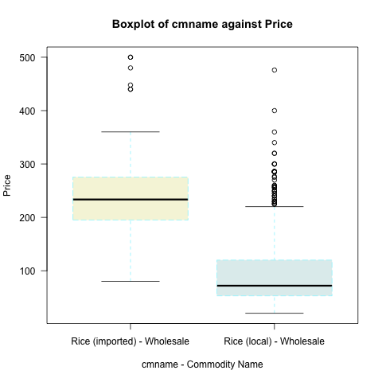

# Ghana Food Prices: Comparison of Local and Imported Rice

**Ameer Ogirimah, Ayesha Naz, Kajalben Bharatbhai Patel, Venkata Dharanendra Raju Gundraju, Shanmukha Krishna Yadav Gavvaji**

**Thursday, January 12, 2023**

---

## Table of Content

[Abstract](##Abstract)

[Introduction](##Introduction)

[Visualization](##Visualization)

[Analysis](##Analysis)

[Conclusions](##Conclusions)

[References](##References)

---

## Abstract

---
The relationship between the price of foreign and imported goods has always been viewed as a vital factor in determining exchange rates in developing countries like Ghana. Rice is a staple food in Ghana and having a good ratio of imported and locally produced quantity has been a focal point for estimating foreign price relationships with the exchange rate and inflation over the years. To understand the price connection, we examined the relationship between the mean price of imported and local rice between 2008 and 2018. The result shows that there is a difference in the prices. Though this is not surprising, it is still interesting to see.

**Key Words:** Ghana, Rice, Price, Imported, Local

---

## 1. Introduction

---
### 1.1. Context

Research has shown that Ghanaian households still prefer to consume imported rice at the expense of domestically produced rice (Research Institute (IFPRI) I, and Agriculture (MoFA), 2020). This has resulted in fear of lopsided foreign exchange and the price of domestically produced rice being dependent on imported rice (Amikuzuno, Issahaku and Daadi, 2020).

### 1.2. Topic

The topic “Ghana food prices: comparison of local and imported rice” assesses the relationship between the price of imported rice and domestically produced rice in Ghana.

### 1.3. Research question and hypothesis

Taking into consideration the above, we try to answer the research question:
>Is there a difference in the mean price between rice (imported) and rice (local) in Ghana between the years 2008 to 2018?

This is done by using our dataset to show that one of the two hypotheses below is a better answer to the above research question:

- Null hypothesis: There is no difference in the mean price between rice (imported) and rice (local) in Ghana between the years 2008 and 2018.

- b)	Alternative Hypothesis: There is a difference in the mean price between rice (imported) and rice (local) in Ghana between the years 2008 and 2018.

### 1.4. Dataset

The dataset is available on the Data.world website and contains the prices of staple food in Ghana between the years 2008 to 2018 (WFP - World Food Programme, 2020). The data source is World Food Program (WFP), and an updated version of the data is available on the WFP website (WFP - World Food Programme, 2023).

The "cmname" column in the dataset represents the commodity name (imported rice and local rice) in commodity quantity units; it is our independent variable column, and the data it contains is nominal. While the "price" column represents the price of the commodities in GHS (Ghanaian cedi), it is our dependent variable, and the data it contains is ordinal.

### 1.5. Results

The data show that there is a difference in means between imported rice and domestically produced rice.

### 1.6. Conclusions

The answer to our research question is not surprising, as the research question could be more interesting and is easily answered by just viewing the dataset.

---

## Visualization

Our dataset contains seventeen (17) columns and eight thousand seven hundred and seventy-seven (8,777) rows. The cmname column has six unique commodity names, as shown in table 1 below:

```
Table 1: cmname - Commodity Name

"Maize - Wholesale"              "Rice (imported) - Wholesale"         "Cassava - Wholesale"           
"Rice (local) - Wholesale"       "Plantains (apentu) - Wholesale"      "Yam - Wholesale"
```
The imported rice values had units of 25 kg, while local rice values had units of 25 kg and 50 kg. So, we filtered out and only used the 25 kg units of both imported and local rice column values. This resulted in the dataset being reduced to two thousand and ninety-one rows (2,091).
We then did boxplots of cmname against price to compare means, as shown in figure 1 below, since our variables are nominal and ordinal.



*Figure 1: Boxplot of cmnane against price*

Figure 1 above shows that imported rice prices are generally higher than local rice. Imported rice prices are also evenly distributed around the median price, while local prices are skewed towards the first quartile. The uneven distribution of local rice might be due to the exclusion of the 50 kg units from the dataset.

Figure 2 and figure 3 are histograms that show the distribution of imported and local rice prices, respectively.


*Figure 2: Histogram of Price of Imported Rice*


*Figure 3: Histogram of Price of Local Rice

The shapes of the overlayed orange curves show that the data is not normally distributed. Though the data for the curve of the imported rice histogram looks normally distributed, it flattens towards the right.

The details of the visualization and analysis below are available in the Bitbucket repository that we used to collaborate on this research (Ogirimah et al., 2023).

---

## Analysis

Considering that our research question, as stated in section 2, asked about a difference in means, the distribution of the histogram for the price variable is not normally distributed, and we only have two independent variables; we used the Wilcox test, as shown in equation 1 below:

*Equation 1: Wilcox test*

>Wilcox.test()

The values of the test statistics are:

>W = 855625,p-value < 2.2e-16

The p-value is less than 2.2e-16, which is much less than 0.1, so we can reject the null hypothesis in favour of the alternative view by stating that “there is a difference in the mean price between rice (imported) and rice (local) in Ghana between the years 2008 and 2018”.

---

## Conclusions

The result of the analysis shows that there is a difference in the price of imported rice as compared to domestically produced rice in Ghana between the years 200 to 2018. This is not surprising as that can be deduced from just looking at the dataset or doing minor calculations.

So, we suggest that future research should either compare the means of the “change in price” of the commodities or try to answer a different research question.

---

## References

Amikuzuno, J., Issahaku, G. and Daadi, B. (2020) ‘Price Transmission between Imported and Local Rice Markets in a Liberalised Economy: Are Ghana’s Rice Wars Just Much I Do about Nothing?’, 4, pp. 109–119.

Ogirimah, A. et al. (2023) A_group-43. Available at: https://bitbucket.org/an22abe/a_group-43/src/master/ (Accessed: 12 January 2023).

Research Institute (IFPRI), I.F.P. and and Agriculture (MoFA), M. of F. (2020) Ghana’s rice market. Available at: https://doi.org/10.2499/p15738coll2.133697.

WFP - World Food Programme (2020) Ghana - Food Prices. Available at: https://data.world/wfp/626e809c-c4fc-467b-a60c-129acb5e9320 (Accessed: 12 January 2023).

WFP - World Food Programme (2023) Ghana - Food Prices. Available at: https://data.humdata.org/dataset/wfp-food-prices-for-ghana (Accessed: 12 January 2023).

---